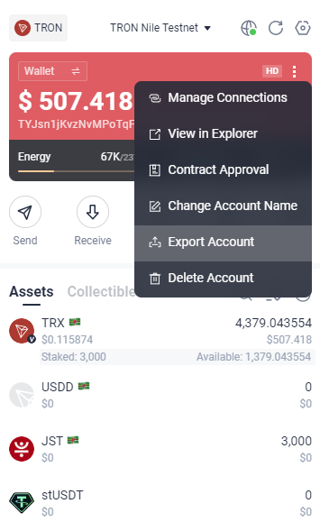

# Ethereum

# 測試合約

``` shell
forge test
```

# 合約發布

## 配置環境變量

 modify .env.example to .env
```
SEPOLIA_RPC_URL=[YOUR_SEPOLIA_RPC_URL]
OWNER_PRIVATE_KEY=[YOUR_PRIVATE_KEY]
ETHERSCAN_API_KEY=[YOUR_ETHERSCAN_API_KEY]
```

* SEPOLIA_RPC_URL: 在alchemy上創建帳號取得api key, 網址: https://www.alchemy.com
* OWNER_PRIVATE_KEY: 在錢包中可以取得私鑰
* ETHERSCAN_API_KEY: 在etherscan上創建帳號取得api key, 網址: https://etherscan.io

## 執行發布腳本及驗證合約

execute forge script to deploy contract on Sepolia testnet
``` shell
# 先把 .env 讀到 shell 裡面, 否則命令行吃不到
export $(grep -v '^#' .env | xargs)
# 執行合約發布腳本
forge script script/Deploy.s.sol:DeployScript --rpc-url $SEPOLIA_RPC_URL --broadcast --verify
```

## 驗證合約

若部署合約時驗證失敗，可再次驗證
``` shell

# 若有 abi 要先取得 abi
abiConstruct=$(cast abi-encode "constructor(string,string)" "TB Dollar" "TBU")

forge verify-contract --chain-id 11155111 --etherscan-api-key $ETHERSCAN_API_KEY $DEPLOYED_CONTRACT_ADDRESS CONTRACT_PATH:CONTRACT_NAME
# example:
#     forge verify-contract --chain-id 11155111 --etherscan-api-key $ETHERSCAN_API_KEY 0xF999Bb94294b537cd423Cd61cda016482cd602A9 src/ERC20Example.sol:ERC20Example
#     forge verify-contract --chain-id 11155111 --etherscan-api-key $ETHERSCAN_API_KEY 0xF999Bb94294b537cd423Cd61cda016482cd602A9 src/ERC20Example.sol:ERC20Example --constructor-args $abiConstruct


forge verify-check --chain-id 11155111 <GUID> <your_etherscan_api_key>
# example:
#     forge verify-check --chain-id 11155111 8xec7ecrt5rqyhzjpmhizwffcsnt3hzebqra3arxcgapw168ny $ETHERSCAN_API_KEY
```

 * ERC20Example address:  0x2c03018E160Bb0A28201b3424f2d3F977e9FeCA1


# Tron

## 配置環境變量
modify .env.example to .env
```
export PRIVATE_KEY_NILE=[YOUR_PRIVATE_KEY]
```
private key 在 tronlink錢包的export account選項中查詢<br>

# 執行腳本

```
source .env && tronbox.cmd migrate --reset --compile-all --network nile
```

## Contract Adress

* ERC20Example address:<br>
TNygkcscRZcqjei9D5b8WT9LoMnra8fXi7